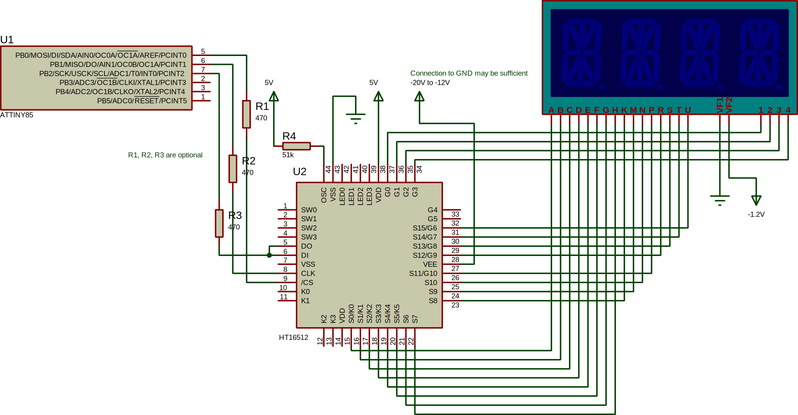
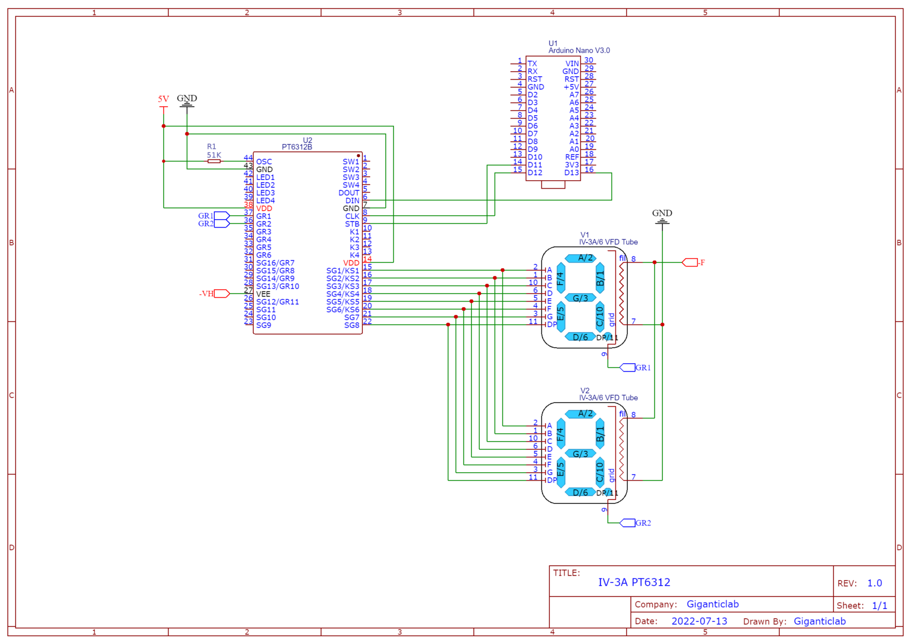

[](https://github.com/ysard/PT6312_VFD_Arduino_Library/releases/latest/)
[](https://www.ardu-badge.com/PT6312)


# PT6312 library for Arduino/AVR

## Summary

PT6312 is an Arduino/AVR library for the PT6312 family of Vacuum Fluorescent Display (VFD)
controllers including for example AD16312, HT16512, ET16312.

It allows the full management of control boards of VFD screens extracted in particular
from DVD players by micro-controllers supporting the Arduino development environment.

For a write-up about VFDs (overview, connection, power supply, control), you can consult 
a series of blog articles (in French) 
[here](https://pro-domo.ddns.net/blog/afficheurs-fluorescents-vfd-theorie-partie-1.html).

## Table of contents

* [Features](#features)
* [Wiring](#wiring)
* [Configuration](#configuration)
    * [Library configuration](#library-configuration)
    * [Screen configuration](#screen-configuration)
* [Functions](#functions)
    * [Generic](#generic)
    * [Display variant 1: 2 chars per grid](#display-variant-1-2-chars-per-grid)
    * [Display variant 2: 1 char per grid](#display-variant-2-1-char-per-grid)
* [Examples](#examples)
* [FAQ](#faq)
    * [Does this work with other Princeton VFD controllers like the PT6311?](#does-this-work-with-other-princeton-vfd-controllers-like-the-pt6311)
* [Contributing](#contributing)
* [PT6312 is free AND open source](#pt6312-is-free-and-open-source)
* [Credits](#credits)


## Features

It supports all the grids and segments combinations of this familly of controllers:

    4 digits, 16 segments
    5 digits, 16 segments
    6 digits, 16 segments
    7 digits, 15 segments
    8 digits, 14 segments
    9 digits, 13 segments
    10 digits, 12 segments
    11 digits, 11 segments

Note: The controller has a limited number of pins. Some of them have a dual role and are
configured by the user according to the display.
Thus, from a certain threshold the increase in the number of grids is done at the cost
of the number of segments.

Additional features:

- Control of 4 LEDs
- Control of 4 keys
- Control of 4 generic switches


## Wiring

Only 3 pins are required from the MCU to communicate with the VFD driver :
CS/STB (Cable Select/Strobe), SCLK (clock) and DATA (IN/OUT).
Ex for the ATtiny85: Pin 5 (PB0) for CS/STB, Pin 6 (PB1) for SCLK, Pin 7 (PB2) for DATA.

The communication is based on SPI protocol, but since data transfer is never simultaneously
in both directions, MISO and MOSI pins are often connected to each other to save a wire connection.

Thus a small AVR like the ATtiny85 is enough to control the display.

Wiring to an ATtiny85:



Wiring between IV-3A tubes and Arduino Nano:



On the controller side (from the PT6312 datasheet (Ex: <http://www.datasheet.hk/view_download.php?id=1110296&file=0018\ad16312_161545.pdf>)):

- VCC: 5V
- VEE: 0 to VCC-30V DC*

The filament must be connected to a negative power rail: ~-1.2V DC* is acceptable.

\* Negative voltages can be obtained very easily by using a very common LM2596 based
DC-DC converter (See `Figure 8-5. Inverting −5-V Regulator With Delayed Start-Up`
of their datasheet here <https://www.ti.com/lit/ds/symlink/lm2596.pdf>).


## Configuration

### Library configuration

The main options are placed in the `global.h` file.

You will find there :
- the definition of the pins to use (For the ATtiny85: Pin 5 (PB0) for CS/STB, Pin 6 (PB1) for SCLK, Pin 7 (PB2) for DATA.
- the characteristics of the screen used (number of grids, number of displayable characters),
- and options related to the library (scrolling speed, use of a buffer dedicated to the usage of icons that can be activated on demand to save space).

### Screen configuration

The existing layouts & implementations are in the [src/display_variants/](src/display_variants/) folder.
The selection of a configuration is done in `global.h`.

However it is unlikely that the character layout supported by your screen would be directly supported.

It will be necessary to create a specific font file (correspondence table between
displayable character and segments to be activated).

A second file containing specific functions of the screen can be made.
The functions concerned are `VFD_writeString()` and `VFD_busySpinningCircle()`.


The other functions of the library are generic. `VFD_segmentsGenericTest()` will be able to
for example, help to identify the number of segments on the screen, leaving enough time to take
notes.


Here is a short function in Python to generate the 2 bytes of a character from a list of active bits,
ready to be inserted in the `FONT` array :

```python
def convert_to_bits(*args):
    # MSB
    msb = "0b" + "".join(map(str, [1 if i in args else 0 for i in range(16, 8, -1)]))
    # LSB
    lsb = "0b" + "".join(map(str, [1 if i in args else 0 for i in range(8, 0, -1)]))

    print(f"{{{msb}, {lsb}}}")

# char 0: bits: 8, 7, 6, 4, 3, 2
convert_to_bits(8, 7, 6, 4, 3, 2)
# Gives: {0b00000000, 0b11101110}
```


## Functions

### Generic

`void VFD_initialize(void);`<br>
Configure the controller and the pins of the MCU.

`void VFD_resetDisplay(void);`<br>
Reset the controller
- Turn on the display by setting the brightness
- Init default command mode (write to memory, auto increment the memory address)

`void VFD_setBrightness(const uint8_t brightness);`<br>
Set display brightness
- **param brightness** Valid range 0..7
for 1/16, 2/16, 4/16, 10/16, 11/16, 12/16, 13/16, 14/16 dutycycles.

`void VFD_clear(void);`<br>
Clear the display by turning off all segments
If ENABLE_ICON_BUFFER is enabled, icons will be cleared by this function
but the buffer is preserved. i.e the icons will reappear with the next call
to VFD_writeString(), VFD_writeInt() or VFD_busySpinningCircle().
- **see** VFD_clearIcons()

`void VFD_setGridCursor(uint8_t position, bool cmd);`<br>
Set the cursor on the controller memory according to the given grid position.
The first address of a grid will be selected for writing.
Should be used BEFORE sending segments data.
Ex: If PT6312_BYTES_PER_GRID == 2 (default), position 1 relies on the first grid,
the memory address on the controller will be 0.
Position 2 relies on the 2nd grid, the address will be 2 (2 bytes further).
- **param position** Position where the next segments will be written.
Valid range 1..VFD_GRIDS.
If position == VFD_GRIDS + 1: The first grid will be selected.
If position > VFD_GRIDS + 1 or VFD_GRIDS == 0: The last grid will be selected.
- **param cmd** (Optional) Boolean transmitted to VFD_command();
If True the CS/Strobe line is asserted to HIGH (end of transmission)
after setting the address.
Default: false

`void VFD_writeInt(int32_t number, int8_t digits_number, bool colon_symbol);`<br>
Write a number
- **param number** Number to display. Can be negative.
- **param digits_number** Number of reserved characters to represent the given number.
If the number is negative, the minus sign '-' will be counted in the digits_number;
thus the digit_number is always respected.
If the number representation uses more space than digits_number,
it will be divided by 10 until it fits in the reserved space.
If the number representation uses less space than digits_number,
it will be padded with zeros.
- **param colon_symbol** Boolean set to true to display the special colon symbol
segment if possible (See VFD_writeString()).

`void VFD_scrollText(const char *string, void (pfunc)());`<br>
Scroll the given string on the display
The speed can be adjusted by modifying VFD_SCROLL_SPEED define.
- **param string** String to display; must be null terminated '\0'.
- **param pfunc** (Optional) Callback called at the end of each scrolling iteration.
It avoids blocking the program during the display loop.
Can be used to test keys, set leds, etc.

`void VFD_busyWrapper(uint8_t address, void(pfunc)());`<br>
Wrapper to VFD_busySpinningCircle(), handle delay between frames and callback.
Delay can be adjusted by modifying the define VFD_BUSY_DELAY.
- **param address** Address (range 0x00..0x15 (22 addresses)) or position (range 1 to number of grids)
passed to VFD_busySpinningCircle(). The use of this variable in this later function
defines its signification (memory address vs grid number).
- **param pfunc** (Optional) Callback called at the end of each frame change.
It avoids blocking the program during the display loop.
Can be used to test keys, set leds, etc.
- **see** VFD_busySpinningCircle()

`void VFD_setLEDs(uint8_t leds);`<br>
Set status of LEDs.
Up to 4 LEDs can be controlled.
- **param leds** Byte where the 4 least significant bits are used.
Set a bit to 1 to turn on a LED.
Bit 0: LED 1
...
Bit 3: LED 4

`uint32_t VFD_getKeys(void);`<br>
Get status of keys
Keys status are stored in the 3 least significant bytes of a uint32_t.
Each of the 4 keys is sampled 6 times.
In a sample, 4 bits for keys: 0, 1, 2, 3 (from least to most significant bit).
If a key is pressed raw_keys is > 0.
Sample Masks:
    Sample 0: raw_keys & 0x0F
    Sample 1: (raw_keys >> 4) & 0x0F
    Sample 2: (raw_keys >> 8) & 0x0F
    Sample 3: (raw_keys >> 12) & 0x0F
    Sample 4: (raw_keys >> 16) & 0x0F
    Sample 5: (raw_keys >> 20) & 0x0F
- **return** 6 samples of 4 bits each in the 3 least significant bytes of a uint32_t

`uint8_t VFD_getKeyPressed(void);`<br>
Get the number of the first pressed button (no multi buttons)
Button 0: 1
...
Button 3: 4
- **see** VFD_getKeys()
- **return** The number of the first pressed button or 0 if no button is pressed.

`uint8_t VFD_getSwitches(void);`<br>
Get status of switches
Switches status are stored in the last 4 bits of the returned byte.
The first (lowest) bit represents switch 0.
Ex: 0b....0001
   |
   switch 0 is pressed

`void VFD_segmentsGenericTest(void);`<br>
Test segment numbering
Lights up a segment from 1st to 16th every 2 seconds so you can
note the VFD structure.

`void VFD_displayAllSegments(void);`<br>
Test the display of all segments of the display.
It's the opposite of VFD_clear().

`void VFD_displayAllFontGlyphes(void);`<br>
Display and scroll all available characters in the current font

`void VFD_command(uint8_t value, bool cmd);`<br>
Send a byte in a write command to the controller
- **param value** Byte to send.
- **param cmd** (Optional)
If True, the CS/Strobe line is asserted to HIGH (end of transmission)
after the byte has been sent.
Default: false

`extern inline void VFD_CSSignal();;`<br>
Signal the driver that the data transmission is over
The CS/Strobe line is asserted to HIGH (end of transmission).

`uint8_t VFD_readByte(void);`<br>
Obtain a byte from the controller (i.e get keys & switches status)
- **see** VFD_getSwitches(), VFD_getKeys(), VFD_getKeyPressed().
- **return** Byte of data

`void VFD_writeByte(uint8_t address, char data);`<br>
Write a specific byte at the given address in the controller memory.
This function doesn't use VFD_setGridCursor() to map the position
to a grid.
- **param address** Value range 0x00..0x15 (22 addresses).
- **param data** Byte to write at the given address.
- **warning** Note that the CS/Strobe line is asserted to HIGH (end of transmission)
after the byte has been sent.
Since a specific address is used, the grid_cursor global variable IS NOT updated,
and is thus more synchronized with the controller memory.
You SHOULD NOT rely on this value after using this function and use
VFD_setCursorPosition().

`void VFD_setIcon(uint8_t icon_font_index);`<br>
Add an icon to the buffer.
The icon will be displayed on the next call to VFD_writeString(), VFD_writeInt()
or VFD_busySpinningCircle();
- **param icon_font_index** Index of the icon in the ICONS_FONT array.
Defines can be used.

`void VFD_clearIcon(uint8_t icon_font_index);`<br>
Remove an icon from the buffer.
The icon will be removed on the next call to VFD_writeString(), VFD_writeInt()
or VFD_busySpinningCircle();
- **param icon_font_index** Index of the icon in the ICONS_FONT array.
Defines can be used.

`void VFD_clearIcons();`<br>
Clear the icon buffer.
All the icons will be removed on the next call to VFD_writeString(), VFD_writeInt()
or VFD_busySpinningCircle();

`inline uint8_t convertGridToMemoryAddress(uint8_t grid);`<br>
Convert grid number to a memory address
- **param grid** Grid number (starting from 0)
- **return** Address of the memory cell in the icon buffer
(or in the memory of the controller).

### Display variant 1: 2 chars per grid

`void VFD_writeString(const char *string, bool colon_symbol);`<br>
Write a string of characters present in the font (If VARIANT_1 is defined in global.h).
- **param string** String must be null terminated '\0'. Grid cursor is auto-incremented.
    For this display 6 characters can be displayed simultaneously.
    For positions 3 and 4, the grids accept 2 characters.
    Positions 1 and 2 accept only 1 char (segments of LSB only),
    the other positions are reserved for icons.
- **param colon_symbol** Boolean set to true to display the special colon symbol
    segment on grid 4.
    The symbol is displayed between chars 4 and 5.
- **warning** The string MUST be null terminated.

`void VFD_busySpinningCircle(uint8_t address, uint8_t &frame_number, uint8_t &loop_number);`<br>
Animation for a busy spinning circle that uses 1 byte (half grid).
- **param address** Memory address on the controller where the animation frames must be set.
- **param frame_number** Current frame to display (Value range 1..6 (6 segments));
This value is updated when the frame is modified.
The frame number goes back to 1 once 6 is exceeded.
- **param loop_number** Number of refreshes for a frame; used to set the duty cycle of fading frames.
This value is incremented at each call.
- **see** VFD_busyWrapper()
- **warning** Since a specific address is used, the grid_cursor global variable IS NOT updated,
and is thus more synchronized with the controller memory.
You SHOULD NOT rely on this value after using this function and use
VFD_setCursorPosition().

### Display variant 2: 1 char per grid

`void VFD_writeString(const char *string, bool colon_symbol);`<br>
Write a string of characters present in the font (If VARIANT_2 is defined in global.h).
- **param string** String must be null terminated '\0'. Grid cursor is auto-incremented.
    For this display 1 grid = 1 character.
- **param colon_symbol** Boolean set to true to display the special colon symbol
    segment on grid 3 or 5.
    The symbol is displayed between chars 3 and 4, or 4 and 5.
- **warning** The string MUST be null terminated.

`void VFD_busySpinningCircle(uint8_t position, uint8_t &frame_number, uint8_t &loop_number);`<br>
Animation for a busy spinning circle that uses 2 bytes (full grid).
- **param position** Grid number where the animation frames must be displayed.
- **param frame_number** Current frame to display (Value range 1..6 (6 segments));
This value is updated when the frame is modified.
The frame number goes back to 1 once 6 is exceeded.
- **param loop_number** Number of refreshes for a frame; used to set the duty cycle of fading frames.
This value is incremented at each call.
- **see** VFD_busyWrapper()

## Examples

A full clock example is available at [examples/test_attiny_vfd/test_attiny_vfd.ino](examples/test_attiny_vfd/test_attiny_vfd.ino).

```c++
// Test all segments
VFD_displayAllSegments();
_delay_ms(1000);

// Test/debug display segments from number 1 to number 16
VFD_segmentsGenericTest()
VFDClear();

// Enable LED output
VFD_setLEDs(PT6312_LED3);

// Set specific icons (Do not forget to enable ENABLE_ICON_BUFFER in the library config)
VFD_setIcon(ICON_DVD);
VFD_setIcon(ICON_PLAY);
VFD_setIcon(ICON_DOLBY);

// Write a big signed int
// This one uses 7 characters it will be cropped to 6: -12345
// The colon symbol will be displayed if available
VFD_home();
VFD_writeInt(-123456, 6, true);

// Scrolling text
VFD_home();
VFD_scrollText("HELLO WORLD", &scrollCallback);

// Write text
VFD_home();
VFD_writeString("COUCOU", false); // Boolean set to false to not display the special colon symbol

// Clear the screen (keep icons, see VFD_clearIcons() to clear them)
VFD_clear()

// Enable spinning circle animation
VFD_busyWrapper(1);
```

## FAQ

### Does this work with other Princeton VFD controllers like the PT6311?

This controller has more memory to address more segments per grid (20 instead of 16
for the AD16312 controller family).
Therefore instead of sending 2 bytes (16 bits) per grid, you have to send 2.5 bytes (20 bits).

The PT6311 can also manage 5 LEDs instead of 4.

Except these minor differences, the protocol is exactly the same.
Thus as it is, the library does not support this controller.
However, it is quite easy to rewrite some functions to make it possible since the
work is already well advanced.

Any contribution is welcome!


## Contributing

Any contribution is welcome!
You can open an issue or propose a pull request.


## PT6312 is free AND open source

PT6312 is released under the GPL (GNU General Public License).
You can read, test and modify its code.


## Credits

Thanks to Istrate Liviu for the first base of the project on his blog
<https://www.programming-electronics-diy.xyz/2017/06/salvage-vfd-from-broken-dvd.html>.

Also thanks to the website <https://os.mbed.com/users/wim/notebook/vacuum-fluorescent-display-vfd-drivers/>
for their precious information.
